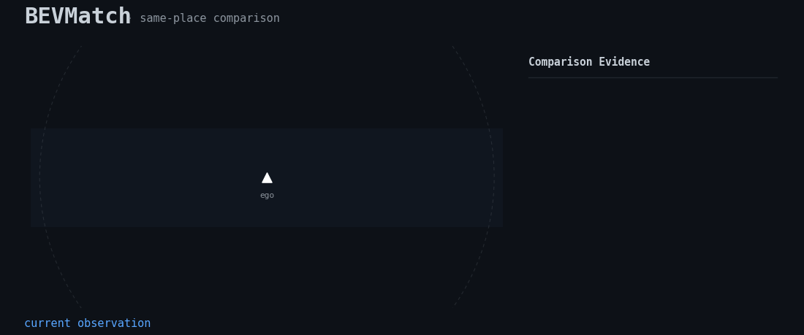
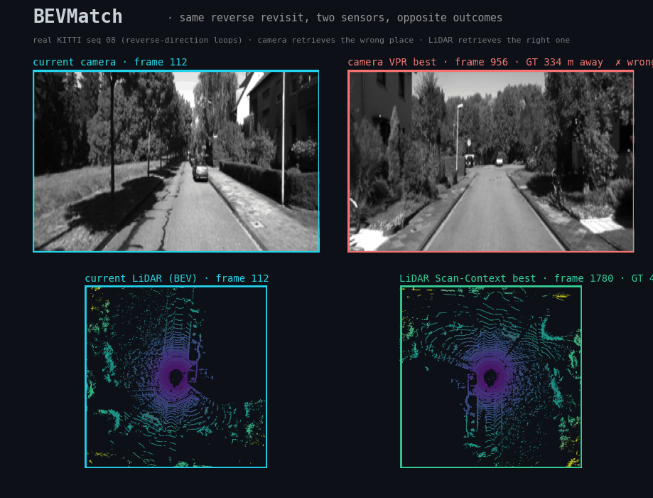

# BEVMatch

<p align="center">
  <a href="https://github.com/rsasaki0109/BEVMatch/actions/workflows/ci.yml"></a>
  
  
  
</p>

<p align="center">
  
</p>
<p align="center"><sub><b>Real data:</b> a LiDAR observation localized against a real 109M-point survey map — BEVMatch retrieves the place among real tiles and recovers the SE2 pose + covariance (actual pipeline output).</sub></p>

<p align="center">
  
</p>
<p align="center"><sub><b>Same framework, camera input</b> (Principle 2): real KITTI seq 00 loop closure — BEVMatch's <code>CameraEmbeddingDescriptor</code> (ResNet-18) matches each current frame (revisit) to its first-visit frame. Data: KITTI odometry (Geiger et al.), research demo.</sub></p>

<p align="center">
  
</p>
<p align="center"><sub><b>Why one sensor is not enough</b> (the real point of Principle 2): real KITTI seq 08 <b>reverse-direction</b> revisits. The forward-facing <b>camera</b> retrieves the wrong place — often hundreds of metres away (red, ✗) — because it sees the opposite view. The 360° rotation-invariant <b>LiDAR</b> Scan-Context retrieves the genuine revisit, metres away (green, ✓). Same query, same database, opposite outcomes — measured, not staged (<a href="docs/benchmarks.md">benchmarks</a>).</sub></p>

> BEVMatch is not another place recognition method.
> It is an OSS pipeline for finding the same place, aligning it, comparing it, and turning differences into map validation evidence.

BEVMatch は、場所を探すだけで終わらない。
**同じ場所を見つけ、整列し、変化を説明し、地図の信頼性を検証する**「Same-Place Comparison OSS」です。

```
Query Scene
  ↓ Place Retrieval
  ↓ Geometric / Semantic Alignment
  ↓ Scene-to-Scene Comparison
  ↓ Change Evidence
  ↓ Map Validation / Map Maintenance Evidence
```

## Status

**v1.1 — Stable platform + real data** 🎉 ロードマップ v0.1→v1.0 完了後、実データ対応を追加。
安定化済みの **artifact schema**（`bevmatch.schema`）、**plugin manifest**（`bevmatch.plugins`, §7.3）、**benchmark protocol**、CI、再現可能 demo suite を備えます。上のヒーロー GIF は実 LiDAR 地図 / 実 KITTI 画像での実パイプライン出力です。

retrieval → alignment → change → map validation → ROS2 → Autoware/Nav2 → benchmark → multi-modal の全レイヤが動作（テスト 79 件全パス）。実 LiDAR（PCD/LAS/KITTI）ローダと、密点群でも OOM しない KD-tree alignment を搭載。コア依存は `numpy` のみ（任意で `scipy` / `matplotlib` / `faiss-cpu` / `rclpy` / `laspy` / `open3d`）。

## Real-data benchmarks — KITTI odometry (place recognition)

公開データセット **KITTI odometry** 上で、標準的な place-recognition プロトコル
（positive = GT pose 距離 ≤ D かつ時間 30s 超離れ、時間近傍は検索から除外）で
BEVMatch 自身の検索パイプラインの **Recall@K を実測**した結果です（合成データではありません）。

<p align="center">
  
</p>

<p align="center"><sub><b>研究ストーリーを1枚に</b>：手作り LiDAR・generic camera・学習系 camera SOTA の3 descriptor を<b>同一インタフェース・同一プロトコル</b>で実測（R@1 @ 5m）。学習系は順方向を押し上げるが、<b>逆方向 seq 08 では両カメラとも ~0.02 に崩壊（視点の壁）</b>。360° LiDAR だけが 0.34 を保ち、config 差し替えのみで 0.76 へ回復。再現: <code>python scripts/make_results_summary.py</code>。</sub></p>

**LiDAR と camera を 5 つのループ列で同一プロトコル比較**（Recall@1 @ 5 m）:

| seq | 00 | 05 | 06 | 07 | 08（**逆方向**） | **mean** |
|---|---|---|---|---|---|---|
| **LiDAR** (Scan-Context) | 0.913 | 0.783 | 0.887 | 0.596 | **0.339** | **0.704** |
| **Camera** (ResNet-18)   | 0.923 | 0.848 | 0.977 | 0.500 | **0.015** | 0.653 |

<sub>**目玉は seq 08（逆方向再訪）**。前方カメラは正反対の景色を見るため appearance では原理的に照合不能で
R@1=0.015 に崩壊。一方 LiDAR は 360°＋回転不変 Scan-Context なので同じ再訪で 0.339 を維持。順方向では
camera が上回ることも多い（seq 06: 0.977 vs 0.887）。**どのセンサも万能でない**＝モダリティ非依存フレームワークの
存在意義。これは Principle 2（modality ≠ representation）の「異なる failure mode」を実データで示すもので、隠さず報告。
seq 07 は revisit 94 件でノイジー。両 descriptor とも素のベースライン（学習系に差し替え可）。
全シーケンス・全閾値・プロトコル・正直な注記は [docs/benchmarks.md](docs/benchmarks.md)。</sub>

**さらに: descriptor 設定の差し替えだけで逆方向ループが回復**（プラグイン config を変えるのみ、パイプライン不変）:

| seq | default (20×60, 30m) | wide (40×120, 80m) | Δ |
|---|---|---|---|
| 00（順方向） | 0.913 | 0.966 | +0.05 |
| 08（**逆方向**） | 0.339 | **0.765** | **+0.43** |

<sub>range を 30→80m に広げると逆方向 recall が **0.34→0.77 と倍以上**に回復（順方向は +0.05）。
逆走の失敗は「対向車線越しの重なる構造を捉えるには range が短すぎた」**設定要因**で、本質的欠陥ではない。
一方 camera の seq 08 崩壊（0.015）は前方カメラの原理的限界で**調整では直らない** — この非対称性こそ
モダリティを併せ持つ意義。再現: `python scripts/experiment_scancontext_config.py`。</sub>

**そして: descriptor を学習系 SOTA に差し替えると順方向は伸びるが、逆方向の壁は破れない**
（EigenPlaces, ICCV 2023 / SF-XL 学習＝KITTI は全 seq held-out, R@1 @ 5 m）:

| seq | ResNet-18 (ImageNet) | EigenPlaces（学習系 VPR） | Δ |
|---|---|---|---|
| 00 | 0.923 | **0.957** | +0.03 |
| 05 | 0.848 | **0.914** | +0.07 |
| 07 | 0.500 | **0.681** | +0.18 |
| 08（**逆方向**） | 0.015 | 0.015 | **±0** |
| **mean** | 0.653 | **0.709** | +0.06 |

<sub>学習系 SOTA descriptor は**順方向**再訪（07 で +0.18, 00/05 も数点）を確実に押し上げる＝表現の質は効く。
**だが逆方向 seq 08 は SOTA でも 0.015 でベースラインと完全一致** — 前方カメラは対向の景色を一度も観測しないため、
どんな appearance descriptor でも照合する対象が無い。これは「表現の差」ではなく**視点・幾何の壁**であり、学習では破れない。
対照的に LiDAR 側の同じ逆方向ケースは descriptor 調整で 0.339→0.765 と回復する（360° は対向通過でも同じ場所を観測するから）。
再現: `python scripts/benchmark_kitti_vpr_learned.py`（EigenPlaces は MIT, `torch.hub` で実行時取得・非 vendoring）。</sub>

**そして決定打: score 融合は負けるが、幾何検証融合は両モダリティを超える**（GT 不使用, R@1 @ 5 m）:

| seq | LiDAR | Camera | naive RRF | conf-gated | **geo-verified** |
|---|---|---|---|---|---|
| 00 | 0.913 | 0.957 | 0.957 | 0.939 | **0.963** |
| 06 | 0.887 | 0.977 | 0.904 | 0.927 | **0.943** |
| 07 | 0.596 | 0.681 | 0.713 | 0.660 | **0.723** |
| 08（**逆方向**） | 0.339 | 0.015 | 0.081 | 0.203 | **0.343** |
| **mean** | 0.704 | 0.709 | 0.695 | 0.714 | **0.779** |

<sub>等重み RRF（**mean 0.695 ＝ 純損**）は seq08 で盲目カメラが LiDAR を 0.339→0.081 に引きずり下ろす。自己信頼度 gate もロバスト止まり（0.714）で **seq08 を救えない**（0.203）— スコアの大小では「confidently wrong（似た別場所への自信ある誤マッチ）」と「confidently right」を区別できないから（seq08 のカメラ top-1 類似度は機能する seq07 より**高い**）。**解は幾何検証**: カメラの提案フレームと query の LiDAR Scan-Context が LiDAR 自身の最良と同等に整合する時のみ採用、否なら LiDAR にフォールバック（＝安価な appearance 提案＋幾何検証というループ閉じ込みの定石）。これが**全5列でベスト・mean 0.779（両単体 +0.07）**、かつ **seq08 を 0.343 ＝ LiDAR 単体 0.339 まで完全回復**（カメラ採用は seq08 で 16%・カメラ強い seq06 で 53%）。「retrieve→**幾何検証**→evidence」という BEVMatch の設計が実データで実証された瞬間。再現: `python scripts/benchmark_kitti_fusion.py`、詳細は [docs/findings.md](docs/findings.md)。</sub>

<p align="center">
  
</p>

<p align="center"><sub>カメラの提案を LiDAR 幾何で検証して採否を決める <b>geometry-verified</b>（緑）が全5列で最良、seq 08 で score 融合（RRF/gate）が崩壊する中 LiDAR 水準へ完全回復。再現: <code>python scripts/make_fusion_figure.py</code>。</sub></p>

```bash
python scripts/benchmark_kitti_vpr.py            # camera VPR (ResNet-18 baseline), all loop sequences
python scripts/benchmark_kitti_vpr_learned.py    # camera VPR (EigenPlaces, learned SOTA)
python scripts/benchmark_kitti_lidar.py          # LiDAR Scan-Context, all loop sequences
python scripts/benchmark_kitti_fusion.py         # LiDAR + camera late fusion (RRF, confidence-gated)
```

> 注: 本 README 下部の合成データ表（満点が出るもの）は配線の sanity check であり、手法の性能評価ではありません。性能は本節と [docs/benchmarks.md](docs/benchmarks.md) で判断してください。

## Quickstart

```bash
pip install -e .            # core (numpy)
pip install -e ".[viz,dev]" # + matplotlib + pytest

python examples/run_demo.py # 合成データでパイプラインを実行
pytest                      # テスト
```

`run_demo.py` は `out/evidence_bundle.json`（Comparison Evidence Bundle）と、
matplotlib があれば `out/same_place_comparison.png`（4 面比較ビュー: 現在 / 過去 /
整列オーバーレイ / 変化）を出力します。

```text
Best match: hist_2 (place=place_2, scan-context, score=0.87)
Alignment: x=-1.04 m, y=+1.21 m, yaw=-1.1 deg, overlap=75%, inliers=90%
Changes: 2 added, 2 removed
```

### Retrieval benchmark (v0.2)

```bash
python examples/run_retrieval_eval.py
```

同一ルート上で descriptor を差し替えて Recall@K / MRR を比較します。
rotation-invariant な Scan-Context が、revisit yaw 下で BEV-grid を上回ることを示します。

```text
descriptor      index         R@1  R@5  MRR
----------------------------------------
scan-context    brute-force   0.833  0.958  0.875
bev-grid        brute-force   0.417  0.583  0.481
```

descriptor（`GlobalDescriptor`）と index backend（`IndexBackend`）はプラグインで、
`SceneDatabase(descriptor=..., index=...)` で差し替えられます（FAISS は `make_index("faiss")`）。

### Alignment benchmark (v0.3)

```bash
python examples/run_alignment_eval.py
```

SE2/SE3 aligner を GT 相対姿勢に対して評価し、failure classification と
SE3 の縮退（平面シーンで z/roll/pitch が観測不能）を表示します。
`out/alignment_residual.png` に整列オーバーレイ + 残差マップを出力します。

```text
aligner       succ  wtol  t_err  r_err  ovlp
se2-bev-xcorr  1.000  1.000  0.083  0.13  0.772
se3-icp        1.000  1.000  0.085  0.14  0.773

Wrong-place alignment: success=False, class=overlap_insufficient, overlap=0.30
SE3 degeneracy (planar scene): unobservable=['z','roll','pitch']
```

aligner（`Aligner`）もプラグインで、`SamePlaceComparisonPipeline(aligner=...)` や
`evaluate_alignment(...)` で差し替えられます。

### Change benchmark (v0.4)

```bash
python examples/run_change_eval.py
```

§11 の「observed difference ≠ actionable change」を2点で実証します。

```text
=== Persistence (dynamic filtering) ===          # 複数フレームで移動物体を除外
actionable: added P/R=1.00/1.00 removed P/R=1.00/1.00  dynamic filtered=7
false actionable changes=0

=== Occlusion vs removal ===                     # 遮蔽を「削除」と誤らない
use_occlusion=False: removed=3 (occluded mis-reported=2)
use_occlusion=True:  removed=1 (occluded mis-reported=0)  occluded=0.33
```

- **comparable region**：両シーンが観測した領域のみ比較（polar ray-cast による遮蔽推定）。
- **temporal persistence**：複数フレームで持続する変化のみ actionable とし、移動物体は `dynamic` として除外。
- `out/change_evidence.png` に before/after + 変化エビデンスの4面ビューを出力。

### Map validation benchmark (v0.5)

```bash
python examples/run_map_validation.py
```

「この地図は現在の世界とまだ一致しているか？」を検証し（ファイル構文検証ではなく、§12.5）、
change evidence を運用判断可能な **Map Validation Issue** に変換します。

```text
| ID            | Severity | Type                     | Location     | Action                    |
| map_a-ISSUE-0 | high     | new_static_obstacle      | (+10.7,+11.2)| Inspect / add to map      |
| map_a-ISSUE-2 | medium   | missing_static_structure | (+19.1,+18.5)| Verify removal; update    |
| map_a-ISSUE-4 | medium   | map_element_unobserved   | (+19.2,+18.5)| Confirm vector element    |

issue P/R/F1 = 1.00/1.00/1.00     fresh map -> 0 issues
```

- point cloud / occupancy / vector(Lanelet2 風) の3 validator（`MapValidator` プラグイン）。
- severity schema（INFO→CRITICAL）+ recommended action + stale region 抽出。
- `out/map_validation_review.md`（人手レビュー用）と `out/map_validation_report.json` を出力。
- 既存の Lanelet2 構文 validator を置き換えず、**observation-to-map consistency** を担う（§12.5）。

### ROS2 integration (v0.6)

Core は ROS2 非依存。bag replay は ROS2 なしで動きます（offline-first, §16.1）。

```bash
python examples/run_ros_replay.py        # ROS2 不要: lifecycle bag replay
```

```text
lifecycle: unconfigured -> inactive -> active
[t=10.0] query_0  match=place_4  changes=3  markers=3  diag={retrieval:OK, alignment:OK, change:WARN}
...
lifecycle: -> finalized
```

ROS2 環境がある場合は rclpy LifecycleNode を起動できます（`MarkerArray` /
`DiagnosticArray` / `PoseWithCovarianceStamped` を publish）。

```bash
python examples/ros2_lifecycle_node.py   # 要 ROS2 (rclpy): configure -> activate -> publish
ros2 topic echo /bevmatch/markers
```

- `bevmatch.ros`：TF tree（`map→odom→base_link→sensor`）、diagnostics、markers、
  lifecycle `BagReplayPipeline`（すべて純 Python・テスト可能）。
- `bevmatch.ros.node`：rclpy `LifecycleNode`（ROS2 がある時のみ import）。

### Autoware / Nav2 adapters (v0.7)

```bash
python examples/run_autoware_nav2.py
```

BEVMatch は Autoware/Nav2 の localization を置き換えず、その周辺を支援します（§17.1, §18.1）。

```text
Autoware initial pose:  place=place_4 pose=(-3.12,-1.21,-29.0deg)  best vs GT 0.17m/0.41deg
                        cov(x,y,yaw)=0.240,0.240,0.0008  (z/roll/pitch -> unobservable)
Autoware loc-health:    reported≈truth -> OK ;  drifted +8m -> ERROR
Autoware map freshness: stale regions = [missing_static_structure]
Nav2 occupancy stale:   [map_stale_region, new_static_obstacle]  blocked areas=1
Nav2 relocalization:    AMCL initial pose = (-3.12,-1.21,-29.0deg)
```

- `AutowareAdapter`：initial pose（NDT Monte-Carlo 前段）、localization health、PCD map freshness、Lanelet2 consistency（§17.2 A–D）。
- `Nav2Adapter`：relocalization assist、`OccupancyGrid` staleness、changed-area annotation（§18.2 A–C）。
- initial pose は alignment から **covariance**（z/roll/pitch を観測不能としてマーク）を付与。

### Benchmark suite (v0.8)

```bash
python examples/run_benchmark_suite.py
```

4 タスクを同一プロトコルで評価し、leaderboard を出力します。descriptor/aligner を
追加して再実行すれば、比較可能なエントリが得られます（§20.5）。

> ⚠️ **これは合成データの sanity check です**（手法の性能評価ではありません）。
> 実データでの性能は [Real-data benchmarks](#real-data-benchmarks--kitti-odometry-place-recognition) / [docs/benchmarks.md](docs/benchmarks.md) を参照。

```text
### retrieval (ranked by recall@1)
| rank | method       | recall@1 | recall@5 | mrr   |
| 1    | scan-context | 0.833    | 0.958    | 0.875 |
| 2    | bev-grid     | 0.417    | 0.583    | 0.481 |
...（alignment / change / map_validation も同様）

retrieval board with external submission:
  1. my-paper-descriptor  R@1=0.900   ← SubmissionEntry で外部結果をマージ
  2. scan-context         R@1=0.833
```

- **dataset cards**（`bevmatch.benchmarks.CARDS`）：各ベンチマークの内容・条件・ライセンスを記述。
- **再現可能な split manifest**：seed から決定的に生成し、ground-truth の **fingerprint(sha256)** で再現性を検証。
- **leaderboard**：task ごとに primary metric でランク。`SubmissionEntry` で外部 plugin の結果を同一 board に統合。

### Multi-modal expansion (v0.9)

```bash
python examples/run_multimodal.py
```

BEVMatch は BEV/LiDAR 専用ではありません（§1.3, Principle 2）。

```text
Modality-agnostic retrieval:
  LiDAR  (Scan-Context BEV): place_2 [OK]
  Radar  (-> BEV occupancy): place_2 [OK]
  Camera (image embedding) : place_2 [OK]

Object-level change:  class_changed(pole->building), moved(vehicle 2.0m), added(vehicle), removed(vehicle)
NL summary: "An object 18 m to the east changed from pole to building. A vehicle moved 2.0 m ..."
```

- **modality**（camera/radar/LiDAR）と **representation**（BEV / image embedding）を分離。
  `CameraEmbeddingDescriptor`、radar→BEV、`SemanticBEV` を提供。
- **object-level change**（`detect_object_changes`）：added / removed / moved / class-changed。
- **scene graph**（`build_scene_graph`）と **自然言語サマリ**（`bevmatch.nl`、VLM/LLM に差し替え可能）。

### Library 利用

```python
from bevmatch import SamePlaceComparisonPipeline, SceneDatabase
from bevmatch.datasets import make_synthetic_same_place

data = make_synthetic_same_place()
db = SceneDatabase(); db.add_all(data.historical)
bundle = SamePlaceComparisonPipeline(database=db).run(data.query)
print(bundle.summary())
```

### 実データ (real point clouds)

実 LiDAR（PCD / LAS / KITTI `.bin`）を取り込めます。密な点群は voxel ダウンサンプルしてから（alignment は KD-tree NN で大規模点群でも OOM しません）。

```python
from bevmatch.datasets import load_pcd, scene_from_points   # load_las_tile / load_kitti_bin も
pts = load_pcd("scan.pcd")                                   # (N, 3)
scene = scene_from_points(pts, "scan0", voxel=0.7, drop_ground=True)
db.add(scene)   # 以降は同じパイプライン
```

`pip install -e ".[perf,data]"`（scipy / laspy / open3d）。

## v0.1 MVP Pipeline

```
Query LiDAR scene
  ↓ Retrieve Top-K historical scenes   bevmatch.retrieval  (Scan-Context descriptor)
  ↓ Align best candidate               bevmatch.alignment  (SE2 BEV xcorr + ICP)
  ↓ Compare in BEV                     bevmatch.representations
  ↓ Added/removed occupancy diff       bevmatch.change
  ↓ Export comparison evidence         bevmatch.io  (ComparisonEvidenceBundle → JSON)
```

| Module | 責務 (architecture.md) |
| --- | --- |
| `bevmatch.core` | データモデル・evidence schema・plugin registry・pipeline (§5, §6, §7, §8) |
| `bevmatch.representations` | BEV occupancy 表現 (§5.4) |
| `bevmatch.retrieval` | descriptor / index プラグイン + Top-K retriever (§9, §7.2) |
| `bevmatch.alignment` | SE2/SE3 aligner プラグイン（BEV相互相関 + ICP）+ failure 分類 (§10, §7.2) |
| `bevmatch.change` | occlusion-aware diff + comparable region + persistence (§11) |
| `bevmatch.maps` | map 検証 validator + issue severity + review report (§12) |
| `bevmatch.ros` | ROS2 統合: TF / diagnostics / markers / lifecycle replay / node (§16) |
| `bevmatch.integrations` | Autoware / Nav2 アダプタ（initial pose / health / staleness）(§17, §18) |
| `bevmatch.eval` | retrieval / alignment / change / map メトリクス (§13) |
| `bevmatch.benchmarks` | dataset cards / 再現 split / suite / leaderboard (§0.8, §13) |
| `bevmatch.sensors` | camera / radar アダプタ（modality-agnostic）(§1.3, Principle 2) |
| `bevmatch.scene_graph` / `bevmatch.nl` | object scene graph / 自然言語サマリ (§5.4, §0.9) |
| `bevmatch.schema` / `bevmatch.plugins` | 安定 artifact schema / plugin manifest (§7.3, §21) |
| `bevmatch.viz` | 整列オーバーレイ・残差可視化（matplotlib 任意）(§15) |
| `bevmatch.datasets` | 合成 same-place / route ベンチマーク (§14) |
| `bevmatch.io` | evidence エクスポート (§16.4) |

### Stability & contribution (v1.0)

- **artifact schema**：`bevmatch.schema`（`ARTIFACT_SCHEMA_VERSION=1.0`）。same major = 互換（additive）。`validate_artifact` / `envelope` / `require_compatible`。
- **plugin manifest**：`bevmatch.plugins`（§7.3）— capability 宣言（modality / representation / invariance / uncertainty / failure modes / license）。plugin 追加には manifest 必須。
- **benchmark protocol**：`BENCHMARK_PROTOCOL_VERSION` + dataset fingerprint で比較可能性を担保。
- **reproducible demo suite**：`python examples/run_all_demos.py`（release gate）。

```python
from bevmatch.schema import validate_artifact, require_compatible
require_compatible(bundle["schema_version"])            # major 不一致なら例外
assert validate_artifact("comparison_evidence_bundle", bundle) == []
```

## Documentation

- [Technical report](docs/report.md) — 3 Finding を arXiv 風にまとめた citable な技術レポート（abstract→設定→結果→考察→限界→再現性→参考文献、2図引用）。
- [Two findings](docs/findings.md) — 同じ知見の読みやすい技術ノート（①表現の質は効く ②視点の壁は学習では破れない ③score 融合は負け幾何検証で両者超え）と正直な限界。
- [Real-data benchmarks](docs/benchmarks.md) — KITTI odometry での実 Recall@K（LiDAR / camera）、プロトコル、合成 sanity との区別。
- [Master Architecture Design Document](docs/architecture.md) — 全体設計、データモデル、plugin / pipeline 設計、評価、ROS2 / Autoware / Nav2 連携、ロードマップ。
- [CONTRIBUTING](CONTRIBUTING.md) — plugin の追加方法、設計原則、benchmark 提出。
- [GOVERNANCE](GOVERNANCE.md) — ライセンス・バージョニング・リリース方針。
- [API compatibility policy](docs/api_compatibility.md) — artifact レベルの互換性ポリシー。
- [Plugin authoring guide](docs/plugin_authoring.md) — descriptor / aligner の実装例。
- [CHANGELOG](CHANGELOG.md) — v0.1 → v1.0 の変更履歴。

詳細な MVP スコープは [§22 Recommended MVP Scope](docs/architecture.md#22-recommended-mvp-scope) を参照。

## License

Apache-2.0 (`bevmatch` core)。詳細は [LICENSE](LICENSE)。
