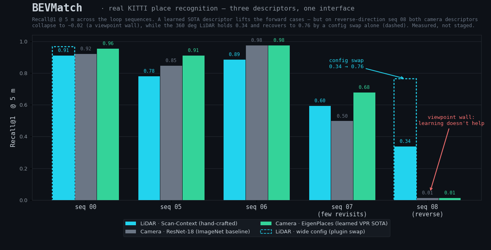
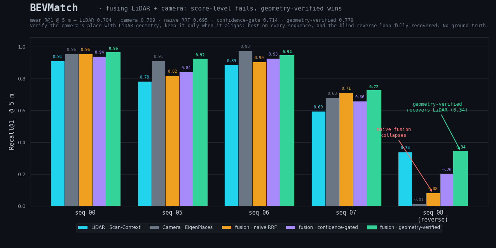

# BEVMatch benchmarks — real public-data results

These are **real** numbers on **public datasets**, produced by BEVMatch's own
retrieval pipeline (not a detached reimplementation). Every table is reproducible
from a script in `scripts/` against data anyone can download.

*The whole story in one figure* (`python scripts/make_results_summary.py`): three
descriptors — hand-crafted LiDAR Scan-Context, the generic ResNet-18 camera
baseline, and the learned EigenPlaces camera SOTA — all behind BEVMatch's one
retrieval interface, on the same protocol. A learned descriptor lifts the forward
cases; on reverse-direction seq 08 both camera descriptors hit a viewpoint wall
(~0.02) that learning does not break, while the 360° LiDAR holds (0.34) and
recovers by a config swap (0.76). Full reasoning in
[Two findings](findings.md); per-sequence tables below.

> Two kinds of numbers live in this repo. Treat them differently:
>
> * **Real-data benchmarks (this file)** — KITTI odometry, standard place-recognition
>   protocol. These are the numbers to judge the method by.
> * **Synthetic sanity checks** (the perfect-score tables in the demos / README) —
>   tiny generated scenes that verify the *plumbing* end-to-end. A perfect score there
>   means "the pipeline runs and is wired correctly", **not** "the method is solved".

## Protocol

Standard place-recognition / loop-closure evaluation (as used by Scan-Context,
OverlapNet, NetVLAD, Patch-NetVLAD, …):

- **Database** = every frame of the sequence.
- **Positive** for query *q* = a frame whose ground-truth pose is within *D*
  metres of *q* **and** more than *T* = 30 s away in time (so trivial same-pass
  neighbours never count as a "revisit").
- **Query set** = every frame that has ≥ 1 positive (i.e. an actual revisit).
- At retrieval time the *T*-second temporal window is excluded from candidates;
  a query is **hit@K** if a positive appears in the top *K* of what remains.
- Ground-truth poses and timestamps come from the KITTI odometry ground truth.

Data: **KITTI odometry** (Geiger et al., *Are we ready for autonomous driving?*,
CVPR 2012). Sequence 00 is the classic loop-closure-rich drive.

## Camera — visual place recognition

`CameraEmbeddingDescriptor` over off-the-shelf **ResNet-18 (ImageNet)** global
features, cosine distance. No VPR-specific training or fine-tuning — this is a
baseline that shows the framework working on real images.

Reproduce: `python scripts/benchmark_kitti_vpr.py` (all sequences) or
`python scripts/benchmark_kitti_vpr.py 00 05` (a subset).

### Across the KITTI loop sequences (positive radius 5 m)

| sequence | revisit queries | Recall@1 | Recall@5 | Recall@20 |
|---|---|---|---|---|
| 00                   | 1706 | 0.923 | 0.942 | 0.954 |
| 05                   |  963 | 0.848 | 0.885 | 0.906 |
| 06                   |  565 | **0.977** | 0.984 | 0.989 |
| 07 (few revisits)    |   94 | 0.500 | 0.596 | 0.692 |
| 08 (reverse loops)   |  616 | **0.015** | 0.042 | 0.097 |
| **mean**             |   —  | **0.653** | 0.690 | 0.728 |

We assert in-script that BEVMatch's `SceneDatabase` reproduces the ranking
(framework check: `SceneDatabase ranking == evaluated cosine`).

*Reading these honestly:* on forward revisits the off-the-shelf ImageNet
features are strong (seq 06 R@1 = 0.98). **seq 08 collapses to 0.015** — and
that is not a bug. seq 08's revisits are *reverse-direction*: a forward-facing
camera driving back the opposite way sees the **opposite view** of the same
place, so an appearance descriptor essentially cannot match it. This is the
textbook failure mode of camera VPR — and exactly where a 360°, rotation-
invariant LiDAR descriptor still works (see the cross-modal section).

### Swapping in a learned SOTA descriptor (EigenPlaces)

The descriptor is a plugin, so a purpose-trained place-recognition network drops
straight in. We benchmark **EigenPlaces** (Berton et al., ICCV 2023 — ResNet-50 +
GeM + FC, 2048-d, cosine), trained on San Francisco eXtra Large street-view.
**SF-XL is disjoint from KITTI**, so KITTI is a genuine held-out domain for *every*
sequence — no train-on-test caveat anywhere. Identical protocol; the in-script
framework check confirms `SceneDatabase` reproduces the learned ranking too.

Reproduce: `python scripts/benchmark_kitti_vpr_learned.py` (EigenPlaces is MIT,
loaded at runtime via `torch.hub`; nothing is vendored).

| sequence | ResNet-18 (ImageNet) R@1 | EigenPlaces R@1 | Δ |
|---|---|---|---|
| 00                   | 0.923 | **0.957** | +0.034 |
| 05                   | 0.848 | **0.914** | +0.066 |
| 06                   | 0.977 | 0.977 | ±0 (ceiling) |
| 07 (few revisits)    | 0.500 | **0.681** | +0.181 |
| 08 (**reverse** loops) | 0.015 | 0.015 | **±0** |
| **mean**             | 0.653 | **0.709** | +0.056 |

Full table in [`docs/assets/kitti_vpr_learned_results.json`](assets/kitti_vpr_learned_results.json).

*The finding that matters is seq 08.* A learned SOTA descriptor lifts every
**forward** revisit case (seq 07 jumps +0.18, seq 00/05 climb several points) —
representation quality clearly helps where the view is shared. **But on the
reverse-direction loops it is pinned at 0.015, byte-for-byte the baseline.** No
amount of descriptor learning recovers it: the forward-facing camera simply never
observes the opposite-direction view, so there is nothing for *any* appearance
descriptor to match. This is a **viewpoint/geometry wall, not a representation
gap** — and exactly the asymmetry that justifies a modality-agnostic framework.
Contrast the LiDAR side below, where the *same* reverse case is recoverable
(0.339 → 0.765) by widening the descriptor, because a 360° sensor *does* observe
the place from the opposite pass.

## LiDAR — Scan-Context place recognition

`ScanContextDescriptor`, BEVMatch's two-stage retrieval exactly as it ships:
a rotation-invariant **ring-key** KNN prefilter, then a full **Scan-Context
column-shift** distance rerank (the same design as Kim & Kim, *Scan Context*,
IROS 2018). Velodyne scans, voxel-downsampled (0.5 m) with a ground filter;
polar grid 20 rings × 60 sectors, 30 m range.

Reproduce: `python scripts/benchmark_kitti_lidar.py` (all sequences) or
`python scripts/benchmark_kitti_lidar.py 00 05` (a subset). Needs the velodyne
scans — `scripts/_fetch_kitti_velodyne_seq00.py` (seq 00) /
`scripts/_extract_velodyne_blocks.py` (seq 05–08).

### Across the KITTI loop sequences (positive radius 5 m)

| sequence | revisit queries | Recall@1 | Recall@5 | Recall@20 |
|---|---|---|---|---|
| 00 (forward loops)   | 1706 | **0.913** | 0.920 | 0.928 |
| 05                   |  963 | 0.783 | 0.797 | 0.804 |
| 06                   |  565 | 0.887 | 0.899 | 0.901 |
| 07 (few revisits)    |   94 | 0.596 | 0.628 | 0.638 |
| 08 (reverse loops)   |  616 | 0.339 | 0.385 | 0.433 |
| **mean**             |   —  | **0.704** | 0.726 | 0.741 |

Full table (5/10/25 m radii, all K) is in
[`docs/assets/kitti_lidar_results.json`](assets/kitti_lidar_results.json).

*Reading these honestly:*
- seq 00/06 (forward revisits) are where Scan-Context shines — R@1 ≈ 0.89–0.91,
  in line with the published Scan-Context baseline.
- seq 08 is dominated by **reverse-direction** revisits (the car drives back
  the opposite way). This is a documented hard case for appearance/structure
  descriptors and pulls R@1 down to 0.34 — we report it rather than hide it.
- seq 07 has very few genuine revisits (94 queries), so its number is noisy.
- The mean across sequences (R@1 = 0.70 @ 5 m) is the honest single figure.

This is a **faithful classical baseline, no learning**, with a deliberately
modest config (20×60 polar grid, 30 m range, default `ScanContextConfig`). The
descriptor is a plugin: a learned LiDAR descriptor (OverlapTransformer,
LoGG3D-Net, …) or a wider range / finer grid can be dropped in without touching
the rest of the pipeline — these numbers are the floor, not the ceiling.

### Tuning the descriptor recovers the reverse-loop case

The seq 08 number above (R@1 = 0.34) is the *default* config, not a ceiling.
Scan-Context is already rotation-invariant (its column shift covers the 180°),
so a reverse revisit should be reachable — the limiting factor is **range**: a
reverse pass is on the *opposite lane*, so the overlapping structure sits
further out than the default 30 m window. Widening the descriptor — a pure
plugin-config swap, no pipeline change — confirms this:

Reproduce: `python scripts/experiment_scancontext_config.py`

| sequence | `default` (20×60, 30 m) | `wide` (40×120, 80 m) | Δ R@1 |
|---|---|---|---|
| 00 (forward) | 0.913 | 0.966 | +0.053 |
| 08 (**reverse**) | 0.339 | **0.765** | **+0.426** |

Widening **more than doubles** reverse-loop recall (0.34 → 0.77) while only
nudging the already-easy forward case (+0.05). So seq 08's low default number is
a *config* limitation, not a fundamental one — and the framework lets you fix it
by swapping the descriptor config alone. (Contrast the camera, below: its seq 08
collapse is intrinsic to a forward-facing appearance sensor and **cannot** be
tuned away.)

## Cross-modal — same place, same protocol, two sensors

Both descriptors run through the **same retrieval framework**, on the **same
sequences**, with the **same revisit protocol** (positive radius 5 m, T = 30 s).
This is the real point of Principle 2 — *modality is not representation*: not
just "it works on both", but **the two modalities have different failure modes**,
and that is exactly why same-place comparison wants more than one sensor.

Recall@1 @ 5 m, per sequence:

| sequence | LiDAR (Scan-Context) | Camera (ResNet-18) |
|---|---|---|
| 00                      | 0.913 | 0.923 |
| 05                      | 0.783 | 0.848 |
| 06                      | 0.887 | **0.977** |
| 07 (few revisits)       | 0.596 | 0.500 |
| 08 (**reverse** loops)  | **0.339** | **0.015** |
| **mean**                | **0.704** | 0.653 |

**The headline is seq 08.** Its revisits are reverse-direction. A forward-facing
**camera** then sees the opposite view of the place and collapses to R@1 = 0.015
(near-zero) — appearance simply cannot bridge a 180° viewpoint flip. The **LiDAR**
descriptor is 360° and rotation-invariant (ring-key + Scan-Context column shift),
so it still recovers R@1 = 0.339 on the very same revisits. On forward loops the
camera is often the stronger of the two (seq 06: 0.977 vs 0.887).

No single sensor wins everywhere — which is the argument for a modality-agnostic
comparison framework rather than a LiDAR-only or camera-only one.

## Fusion — combining the two is not a free lunch

If the modalities fail differently, does fusing them recover the blind cases? We
test three ground-truth-free late-fusion strategies over the *same* rankings
(`python scripts/benchmark_kitti_fusion.py`): equal-weight **Reciprocal Rank
Fusion**; a **confidence gate** (per query, trust whichever sensor has the larger
top-1-vs-top-2 score margin, Lowe-style); and **geometric verification** (trust
the camera's proposed place only if its two LiDAR scans align almost as well as
LiDAR's own best — Scan-Context distance within ALPHA = 1.3 — else fall back to
LiDAR).

| seq | LiDAR | Camera | naive RRF | conf-gated | **geo-verified** |
|---|---|---|---|---|---|
| 00 | 0.913 | 0.957 | 0.957 | 0.939 | **0.963** |
| 05 | 0.783 | 0.914 | 0.819 | 0.841 | **0.922** |
| 06 | 0.887 | 0.977 | 0.904 | 0.927 | **0.943** |
| 07 | 0.596 | 0.681 | 0.713 | 0.660 | **0.723** |
| 08 (**reverse**) | 0.339 | 0.015 | 0.081 | 0.203 | **0.343** |
| **mean** | 0.704 | 0.709 | 0.695 | 0.714 | **0.779** |

Full numbers in [`docs/assets/kitti_fusion_results.json`](assets/kitti_fusion_results.json).

- **Naive equal-weight RRF is a net loss** (mean 0.695, below both single
  modalities): on seq 08 the blind camera drags LiDAR down from 0.339 to 0.081.
- **The confidence gate only buys robustness** (mean 0.714, never catastrophic)
  but **does not recover the blind case** (seq 08 → 0.203): score magnitude can't
  tell "confidently wrong" from "confidently right" (the camera's mean top-1
  cosine is even *higher* on the blind seq 08 than on the working seq 07).
- **Geometric verification wins on every sequence** (mean **0.779**, +0.07 over
  either modality) and **fully recovers the blind case** (seq 08 = 0.343 ≈ LiDAR's
  0.339): the camera's geometrically-wrong reverse-loop proposal fails the
  alignment check and is rejected (camera accepted on 16% of seq 08 queries vs 53%
  on camera-strong seq 06), while its correct forward-loop proposals are kept,
  lifting seq 00/05 above LiDAR.

The honest takeaway: fusing *scores* doesn't beat the better sensor; fusing on
**geometric verification** — trust a match only when the geometry confirms it —
turns two individually-limited sensors into a retriever that beats both. That is
why the framework is retrieve → align → evidence, not retrieval score alone.
Full reasoning in [Two findings → Finding 3](findings.md).

## Notes on honesty

- The synthetic demo tables (`examples/run_*_eval.py`, some README snippets)
  exist to test wiring and stay green in CI. They are **not** evidence of
  method quality; this file is.
- We report the descriptors BEVMatch actually ships (Scan-Context, BEV grid,
  ResNet-18 embeddings). They are honest baselines, deliberately swappable.
