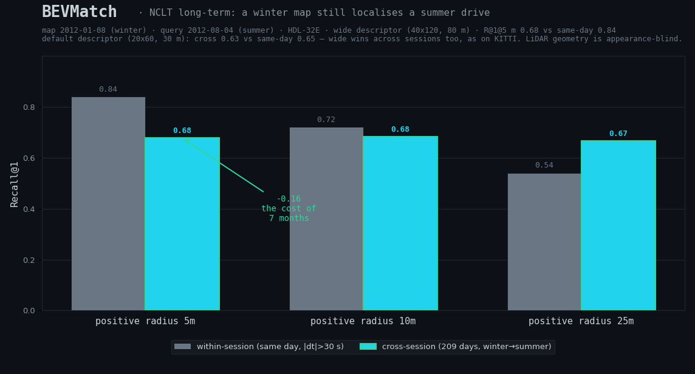

# Five findings from the BEVMatch benchmarks

A short, honest technical note. Everything here is measured on **public KITTI
odometry** data (and, for Findings 4–5, **NCLT**) by BEVMatch's own retrieval
pipeline, on one standard place-recognition protocol, and is reproducible from
`scripts/`. Numbers and the
exact protocol live in [benchmarks.md](benchmarks.md); the formal, citable
write-up with references is [report.md](report.md); this note is about what they
*mean*.

## Setup in one paragraph

We evaluate place recognition (loop closure) on the KITTI loop sequences
00/05/06/07/08. A query's **positive** is a frame within *D* metres of its
ground-truth pose and more than 30 s away in time; the 30 s temporal window is
excluded from retrieval candidates so trivial same-pass neighbours never count.
We report **Recall@1 @ 5 m**. Three descriptors run behind BEVMatch's single
retrieval interface (`GlobalDescriptor` → `SceneDatabase`):

| descriptor | modality | learned? | training data |
|---|---|---|---|
| Scan-Context (ring-key + column-shift) | LiDAR, 360° | no | — |
| ResNet-18 (ImageNet) global features | camera, forward | pretrained, generic | ImageNet |
| EigenPlaces (ResNet-50 + GeM, 2048-d) | camera, forward | yes, for VPR | SF-XL street-view |

EigenPlaces never sees KITTI in training (SF-XL ⟂ KITTI), so every KITTI sequence
is a genuine held-out domain — the camera-vs-camera comparison is fair everywhere.

| seq | LiDAR Scan-Context | Camera ResNet-18 | Camera EigenPlaces |
|---|---|---|---|
| 00 | 0.913 | 0.923 | **0.957** |
| 05 | 0.783 | 0.848 | **0.914** |
| 06 | 0.887 | 0.977 | 0.977 |
| 07 | 0.596 | 0.500 | **0.681** |
| 08 (reverse) | **0.339** | 0.015 | 0.015 |
| mean | 0.704 | 0.653 | **0.709** |

## Finding 1 — within a modality, representation quality is real and measurable

Swapping the generic ImageNet ResNet-18 for a place-recognition–trained
descriptor (EigenPlaces) improves recall on **every forward-revisit sequence**:
seq 07 jumps +0.18 (0.500 → 0.681), seq 05 +0.07, seq 00 +0.03; seq 06 is already
at the 0.977 ceiling. The mean over the camera-favourable cases moves clearly up.
This is the expected, encouraging result: a better-learned representation of the
*same* observation retrieves better, and because the descriptor is a plugin, the
upgrade is a one-line swap with no pipeline change. **Representation matters.**

## Finding 2 — across a viewpoint gap, representation quality is not enough

Sequence 08's revisits are **reverse-direction**: the car drives back down the
same road the opposite way. A forward-facing camera then observes the *opposite
view* of each place. Here both camera descriptors — the generic baseline **and**
the learned SOTA — sit at **R@1 = 0.015**, byte-for-byte identical. Throwing a
stronger, purpose-trained network at the problem changes *nothing*, because the
sensor never records the view that would need to be matched. There is no
representation of an observation that was never made.

This is the distinction the framework is built around (Principle 2:
**modality ≠ representation**). The reverse-loop failure is not a representation
gap that more learning closes; it is a **viewpoint / geometry wall** set by the
sensor. The evidence that it is *sensor*-bound, not *descriptor*-bound:

- The same reverse seq 08, seen by a **360° LiDAR**, is solved to **R@1 = 0.339**
  with the hand-crafted Scan-Context — and **recovered to 0.765** by *only*
  widening the descriptor config (range 30→80 m, grid 20×60→40×120; no pipeline
  change). A rotation-invariant sensor *does* observe the place on the opposite
  pass, so a better descriptor of that observation helps.
- The camera, observing the opposite view, cannot be rescued the same way: 0.015
  before learning, 0.015 after.

So the *same* intervention — a better/wider descriptor — moves LiDAR from 0.34 to
0.77 but leaves the camera pinned at 0.02. The asymmetry is the point: **when one
sensor is blind to a revisit, no descriptor recovers it; a second modality that
is not blind does.** That is the concrete, measured argument for a
modality-agnostic same-place framework rather than a single-sensor pipeline.

## Finding 3 — naive fusion fails, but geometric verification delivers best-of-both

If the modalities fail differently, the obvious hope is that *combining* them
recovers the blind cases. We tested it honestly: the *obvious* (score-level)
versions do **not** work, but a *geometric* one does. All rankings run behind the
one interface; no ground truth is used (`python scripts/benchmark_kitti_fusion.py`):

| seq | LiDAR | Camera | naive RRF | conf-gated | **geo-verified** |
|---|---|---|---|---|---|
| 00 | 0.913 | 0.957 | 0.957 | 0.939 | **0.963** |
| 05 | 0.783 | 0.914 | 0.819 | 0.841 | **0.922** |
| 06 | 0.887 | 0.977 | 0.904 | 0.927 | **0.943** |
| 07 | 0.596 | 0.681 | 0.713 | 0.660 | **0.723** |
| 08 (reverse) | 0.339 | 0.015 | 0.081 | 0.203 | **0.343** |
| **mean** | 0.704 | 0.709 | 0.695 | 0.714 | **0.779** |

The score-level fusions (RRF, confidence-gate) are the cautionary tale; the
geometry-verified fusion is the resolution. Taking each in turn:

- **Naive equal-weight Reciprocal Rank Fusion is a net loss** (mean 0.695, *below
  both* single modalities). On seq 08 it scores 0.081 — far under LiDAR's 0.339.
  Why: RRF rewards candidates *both* rankings place high, but a true reverse-loop
  revisit ranks high only in LiDAR and randomly in the blind camera, so its fused
  score is mediocre. **The failed sensor actively drags the working one down.**
- **A confidence gate helps, modestly.** Trusting, per query, whichever sensor is
  more self-confident (top-1-vs-top-2 score margin, Lowe-style, normalised per
  modality) gives the **best mean (0.714)** — it is never *catastrophic* the way
  the camera alone is on seq 08 (0.081 → 0.203). That robustness is the small,
  real win.
- **But it still does not recover the blind case.** On seq 08 the gate picks the
  (blind) camera on ~49% of queries and lands at 0.203, well short of LiDAR's
  0.339. A *within-sequence, self-normalised* margin cannot encode the absolute
  fact "the camera is globally blind on this drive": each modality's margin is
  normalised to its own median, so neither looks unconfident in relative terms.

And it goes deeper: **even absolute score magnitude does not flag the blind
case.** The camera's mean top-1 cosine is *higher* on the blind seq 08 (0.46)
than on seq 07 (0.41), where the camera actually works (R@1 = 0.68 vs 0.015). On
a reverse loop the camera confidently matches a *similar-looking wrong* place, so
its score is moderate-to-high while the retrieval is geometrically wrong —
"confidently wrong" is indistinguishable, by score alone, from "confidently
right". No descriptor-confidence gate (relative *or* absolute) can separate them;
that separation requires **geometric verification** of the retrieved candidate —
exactly the job of BEVMatch's downstream alignment + evidence stage, not the
retrieval score.

**The resolution — verify geometry, not score.** So we do exactly what the score
cannot: verify the camera's proposed place *geometrically*. Per query we trust the
camera's top-1 only if the two LiDAR scans (at the query frame and the camera's
proposed frame) align almost as well as LiDAR's own best — Scan-Context alignment
distance within a factor ALPHA = 1.3 — otherwise we fall back to LiDAR's ranking.
No ground truth; one extra Scan-Context alignment per query. This is the classic
robot loop-closure recipe (cheap appearance proposal, geometric check) expressed
in BEVMatch's interface, and it **wins on every sequence** (the *geo-verified*
column): mean R@1 = **0.779**, well above either modality alone (0.704 / 0.709)
and far above the score-level fusions (0.695 / 0.714).

Crucially it **fully recovers the blind case** — seq 08 = 0.343 ≈ LiDAR's 0.339 —
because on a reverse loop the camera's geometrically-wrong proposal fails the
alignment check and is rejected (verification accepts the camera on only 16 % of
seq 08 queries, versus 53 % on camera-strong seq 06). The same mechanism that
ignores the confidently-wrong camera on seq 08 *keeps* it where it is right,
lifting the forward loops above LiDAR (seq 00 0.963, seq 05 0.922).

The honest lesson: **late fusion of a working and a blind sensor is not
automatically better than using the working one** if you fuse *scores* — naive
RRF is a net loss and a confidence gate only buys robustness. What works is
fusing on **geometric verification**: trust a modality's match only when the
geometry confirms it. That is precisely why a same-place framework carries
per-modality geometry/evidence (retrieve → align → evidence) rather than stopping
at a retrieval score — and here that architecture, on real data, turns two
complementary-but-individually-limited sensors into a retriever that beats both.

## Finding 4 — the LiDAR retrieval generalises beyond KITTI (and so does the config lesson)

Everything above is KITTI. To check it is not KITTI-overfit, we run the *same*
Scan-Context code and protocol on **NCLT** (Michigan North Campus Long-Term) — a
different city, a Segway platform, and a **different sensor (Velodyne HDL-32E, 32
beams vs KITTI's 64)** — parsing NCLT's packed `velodyne_hits.bin` into 10 Hz
revolutions (3716 scans, a 94-minute campus route; `scripts/benchmark_nclt_lidar.py`).

| config | NCLT R@1 @ 5 m | (queries) |
|---|---|---|
| default (20×60, 30 m) | 0.358 | 1664 |
| **wide (40×120, 80 m)** | **0.620** | 1664 |

Two things hold. **(a) It generalises** — the same code recovers 62 % of revisits
at top-1 on a wholly different dataset, well above chance, though below KITTI's
best (seq 00 wide 0.966): the 32-beam sensor is half KITTI's density and a
vegetated campus is a harder target, both expected. **(b) The config lesson from
Finding 2 transfers** — the *same* "wide" descriptor that rescued KITTI's reverse
loops (0.34 → 0.77) nearly doubles NCLT recall (0.358 → 0.620), because NCLT's
larger, open campus needs the longer 80 m range. The method generalises, and so
does the knowledge of how to tune it.

## Finding 5 — the map survives the seasons (cross-session, 209 days apart)

Finding 4's NCLT run is still *within one session*: the map and the queries are the
same afternoon's drive. The real long-term question — the one the "Long-Term" in
NCLT's name is for — is whether a map built on one day still localises a drive made
months later, after the campus has changed season. So we build the reference map
from **2012-01-08 (winter)** and query it with **2012-08-04 (summer)** — 209 days and
a full change of foliage, light and construction later. NCLT's ground truth is
geo-referenced to one campus frame shared across days, so a summer frame is a true
revisit of a winter frame iff their poses are within *D* m; there is no temporal
exclusion (the two drives are different days). The *same* sync loader and descriptor
also run a same-day baseline (2012-01-08 vs itself, `scripts/benchmark_nclt_cross_session.py`).

| | within-session (same day) | cross-session (209 days) |
|---|---|---|
| wide, R@1 @ 5 m | 0.840 | **0.678** |
| wide, R@1 @ 10 m | 0.721 | 0.682 |
| wide, R@1 @ 25 m | 0.541 | 0.666 |
| default, R@1 @ 5 m | 0.645 | 0.634 |



**The map survives.** A winter map localises a summer traverse at **R@1 @ 5 m =
0.68** — only **0.16 below** the same-day baseline (0.84). Seven months and a full
season cost about a sixth of the recall; the system degrades gracefully, it does not
collapse. This is the LiDAR mirror image of Finding 2: a camera's appearance
descriptor would be hammered by the seasonal change (different foliage, snow, light),
whereas Scan-Context reads only range geometry, which the seasons barely move — so
the modality that *lost* the viewpoint battle (Finding 2) *wins* the long-term one.
**And the config lesson transfers a third time**: wide (0.678) again beats default
(0.634), as on KITTI's reverse loops and NCLT within-session.

Two honest caveats. (i) Past 5 m the cross-session number actually *exceeds* the
same-day baseline (e.g. 0.666 vs 0.541 @ 25 m) — not because cross-session is
*easier*, but because the same-day baseline excludes a 30 s window and so its
positives are geometrically-distant true loop closures that thin out as *D* grows,
while the cross-session positives are dense overlap between two traverses of the same
roads; the two query sets are not identical, so read the tight 5 m column as the
honest like-for-like. (ii) This within-session baseline (sync loader, 0.840) is
higher than Finding 4's (hit-stream, 0.620): the official `velodyne_sync` product is
cleaner than our hand-rolled hit-stream accumulation, which is why we use it here —
the fair comparison is cross-vs-within *within this experiment*, both on the same
loader.

## Honest limitations

- **Grayscale camera.** We use KITTI `image_0` (grayscale, replicated to 3
  channels); EigenPlaces trained on RGB. The forward-case camera numbers would
  likely be somewhat higher with color `image_2`. This does **not** affect
  Finding 2 — the reverse-loop collapse is geometric, not photometric, and color
  cannot manufacture an unobserved view.
- **Cross-dataset/-session work is LiDAR-only.** Findings 4–5 validate the *LiDAR*
  retrieval on NCLT (within-session and across 209 days), but the camera/fusion
  findings (2, 3) were not re-run there (NCLT's camera is a 360° Ladybug, not a
  forward monocular, so the reverse-view geometry differs). Finding 5 uses a single
  winter→summer pair; a sweep over more seasons and longer gaps (a full year+) is the
  natural next step.
- **seq 07 is small.** 94 revisit queries; treat its absolute number as noisy
  (the *direction* of the EigenPlaces improvement is still clear).
- **A "stronger" geometric verifier needs calibration; the relative proxy does
  not.** We replaced the Scan-Context proxy with BEVMatch's full SE2 aligner (BEV
  cross-correlation + ICP, `success` = overlap ≥ 0.45) as the verifier
  (`scripts/experiment_icp_verification.py`). Out of the box it *over-accepts*: on
  blind seq 08 it accepts the camera on 89 % of queries and lands at R@1 = 0.068
  (vs the proxy's 0.343). But a threshold sweep shows that is calibration, not
  incapacity — a stricter τ recovers most (seq 08: 0.068 → 0.339 as τ 0.45 → 0.85).
  The catch is the optimal τ is *opposite* per sequence (blind seq 08 wants strict,
  camera-right seq 06 wants lenient: 0.977 → 0.929 as τ tightens), so one absolute
  threshold is a compromise (τ ≈ 0.75 → seq 08 0.320, seq 06 0.972). The relative
  proxy matches that with **no per-dataset tuning** (one α = 1.3 → 0.343 / 0.943),
  and is marginally ahead on the blind case. So: a tuned absolute verifier is
  competitive; the relative one is simply calibration-free.
- **The acceptance factor ALPHA is not cherry-picked.** Sweeping ALPHA over a 2×
  range, the mean R@1 @ 5 m barely moves and stays above every single-modality
  and score-fusion number throughout:

  | ALPHA | 1.0 | 1.1 | 1.2 | **1.3** | 1.5 | 2.0 |
  |---|---|---|---|---|---|---|
  | mean verified R@1 | 0.762 | 0.766 | 0.774 | **0.779** | 0.784 | 0.780 |

  Looser ALPHA helps the camera-strong forward loops and hurts the blind seq 08
  (0.347 → 0.287 from 1.0 → 2.0, as more wrong proposals slip through), so the
  mean plateaus around 1.3–1.5; the default 1.3 sits on that plateau.

## Reproduce

```bash
python scripts/benchmark_kitti_lidar.py            # LiDAR Scan-Context, all sequences
python scripts/benchmark_kitti_vpr.py              # Camera ResNet-18 baseline
python scripts/benchmark_kitti_vpr_learned.py      # Camera EigenPlaces (MIT, torch.hub)
python scripts/experiment_scancontext_config.py    # LiDAR default-vs-wide on seq 00/08
python scripts/benchmark_kitti_fusion.py           # LiDAR+camera late fusion (RRF, gated)
python scripts/benchmark_nclt_lidar.py [--wide]    # NCLT within-session (Finding 4)
python scripts/benchmark_nclt_cross_session.py [--wide]  # NCLT winter→summer (Finding 5)
python scripts/make_results_summary.py             # the summary figure
```

Descriptor sources: Scan-Context is BEVMatch's own implementation; EigenPlaces is
loaded at runtime from `gmberton/eigenplaces` (MIT) and is **not** vendored.
